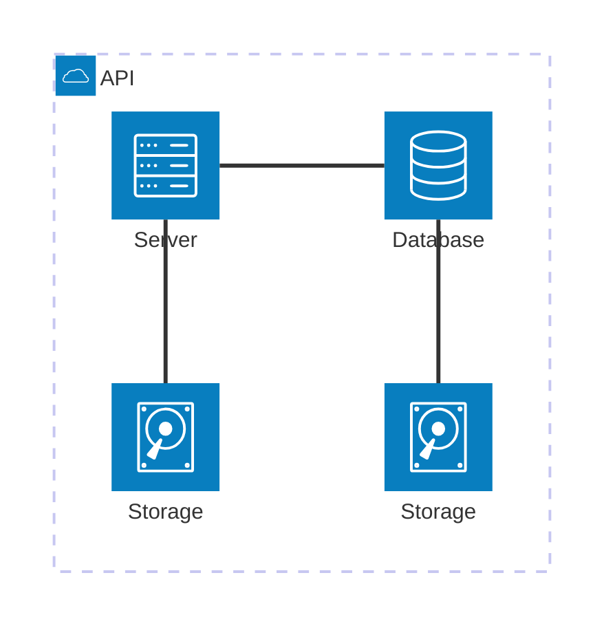

## Usage

### Docopt language

To define the cli interface of AutoDev, [docopt](https://github.com/jazzband/docopt-ng) command definition language will be used.

The following is a summary of the language constructs used in AutoDev's definition

The docopt language defines the 'help message' of a command to define it's usage and options.

Usage pattern is a substring of the help message that starts with 'usage:' (case insensitive) and ends with a visibly empty line.

The first word after usage: is interpreted as the command's name, e.g.: 

```py
"""
Usage: simple_program.py

"""
```

The usage defines:

- Optional elements are specified within square brackets, e.g.: `program.py [optional-argument]`
- Arguments are specified with upper-case words, e.g. `program.py ARGUMENT`

Every line that starts with `-` or `--` defines an option for the command, e.g.: `-o` or `--option`

Synonymous short and long options can be defined on the same line, separated by a comma, e.g.: `-o, --option`

Two spaces can be used to separate an option from it's informal description, e.g.: `-o  Informal description.`

### AutoDev usage definiton

The usage of AutoDev's command `autodev` is defined as follows, using [docopt](https://github.com/jazzband/docopt-ng) command definition language:

```py
"""AutoDev

Usage: autodev.py [PATH-TO-PROJECT]

Generates development environment configuration for project located at PATH-TO-PROJECT.

Generates for current directory if PATH-TO-PROJECT is not passed.

Options:
  -h, --help
  -d, --direnv  Generate .envrc file also.

"""
```

## LLM interface

AutoDev uses [Ollama](https://ollama.com/) to call upon local LLM models.

This requires that a compatible version of ollama is installed in the user system before running AutoDev.

## Modules

The source code is modularized as follows



[Back to index](./index.md) |
[Previous Chapter](./requirements.md) |
[Next Chapter](./detailed-design.md) |
