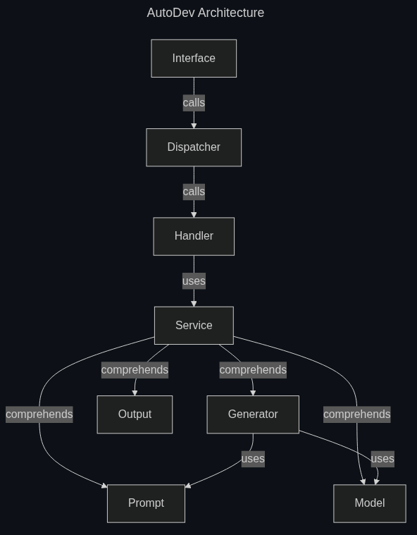

## Usage

### Docopt language

To define the cli interface of AutoDev, [docopt](https://github.com/jazzband/docopt-ng) command definition language will be used.

The following is a summary of the language constructs used in AutoDev's definition

The docopt language defines the 'help message' of a command to define it's usage and options.

Usage pattern is a substring of the help message that starts with 'usage:' (case insensitive) and ends with a visibly empty line.

The first word after `usage:` is interpreted as the command's name, e.g.: 

```py
"""
Usage: simple_program.py

"""
```

The usage defines:

- Optional elements are specified within square brackets, e.g.: `program.py [optional-argument]`
- Arguments are specified with upper-case words, e.g. `program.py ARGUMENT`

Every line that starts with `-` or `--` defines an option for the command, e.g.: `-o` or `--option`

Synonymous short and long options can be defined on the same line, separated by a comma, e.g.: `-o, --option`

Two spaces can be used to separate an option from it's informal description, e.g.: `-o  Informal description.`

Default values for arguments can be defined with the following form: `[default: value]`

### AutoDev usage definiton

The usage of AutoDev's command `autodev` is defined as follows, using [docopt](https://github.com/jazzband/docopt-ng) command definition language:
<!-- TODO remember to update this with final usage -->

```py
"""AutoDev

Usage:
  autodev.py [PATH-TO-PROJECT] [-q | --quiet] [-d | --direnv] [-m MODEL-NAME] [-p PROMPT-FILE-PATH]
  autodev.py -l | --list

Generates development environment configuration for a project.

Use `nix develop` to start development environment.

Options:
  PATH-TO-PROJECT                                 Path to the project the dev env is for. [default: ./]
  -h, --help                                      Display help message.
  -q, --quiet                                     Disable prints.
  -d, --direnv                                    Generate .envrc file also.
  -m MODEL-NAME, --model MODEL-NAME               Model to use to generate the config. One of: temp temp temp [default: llama3]
  -l, --list                                      List available and installed models.
  -p PROMPT-FILE-PATH, --prompt PROMPT-FILE-PATH  Custom prompt file path.

"""
```

## Development

To enter AutoDev's development enviroment:

```sh
nix develop
```

[Just](https://github.com/casey/just) is used to simplify running commands.

To see available commands:

```sh
just
```

## Custom Prompt

<!-- TODO add here the structure of the custom prompt -->
<!-- probably json I guess -->

## Modules

The source code organized in the following modules:

- Interface: responsible for defining command api and related command parsing, similar to a View in MVC architecture;
- Dispatcher: responsible for linking the command arguments to the correct execution of handler functions;
- Handlers: responsible for handling high level command operations;
- Services: responsible for defining business logic common to multiple handlers;
- Generator: responsible for generating dev env config;
- Prompt: responsible for defining prompt formats to be passed to LLMs;
- Model: responsible for wrapping the LLM service;
- Output: responsible for generating output, be it in file or cli print format.



[Back to index](./index.md) |
[Previous Chapter](./requirements.md) |
[Next Chapter](./detailed-design.md) |
