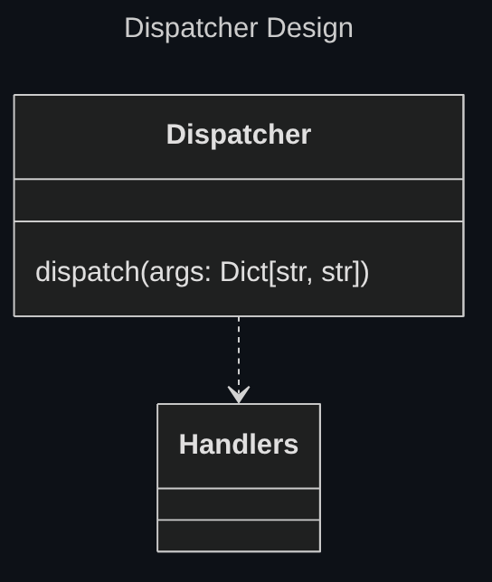
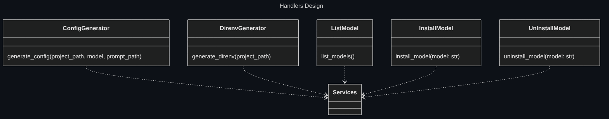
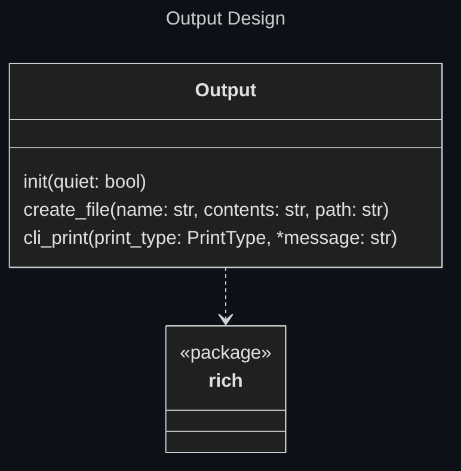

## Language

Python is the de-facto standard language for Machine Learning and LLM APIs.

Python also has a good cli interface generator in the [docopt package](https://github.com/jazzband/docopt-ng).

For these reasons python is the chosen language for this project.

## Modules

### Interface

The [docopt](https://github.com/jazzband/docopt-ng) package is used to define the arguments accepted by AutoDev.

The Interface module simply calls the dispatch function exposed by the Dispatcher with the cli arguments provided by the user as arguments.

### Dispatcher

Similar to a router in a web application, the Dispatcher calls the correct handlers with correct arguments depending on argments passed through the cli.

### Handlers

The handlers expose the high level functionalities of AutoDev.

They call services to execute the actual business logic.

### Services

The services define business logic for AutoDev's functionalities.

#### Prompt

<!-- TODO add how custom prompt parsing works -->

#### Model

The Model module is a wrapper around the [litellm](https://github.com/BerriAI/litellm) package.

This wrapper serves as an anti-corruption layer, ensuring if the underlying package would change only the Model module would have to be changed.

Also the Model interface only exposes the needed methods for AutoDev, hiding additional functionalities the underlying package provides.

#### Output

The Output service is reponsible for the outputs of the project.

The Output service must be initialized before use. The initialization is necessary to specify if the output should be quiet for this run.

For terminal based outputs the [rich](https://github.com/Textualize/rich) package.

For file creation the os python built package is used.

[Back to index](./index.md) |
[Previous Chapter](./architectural-design.md) |
[Next Chapter](./implementation.md) |
