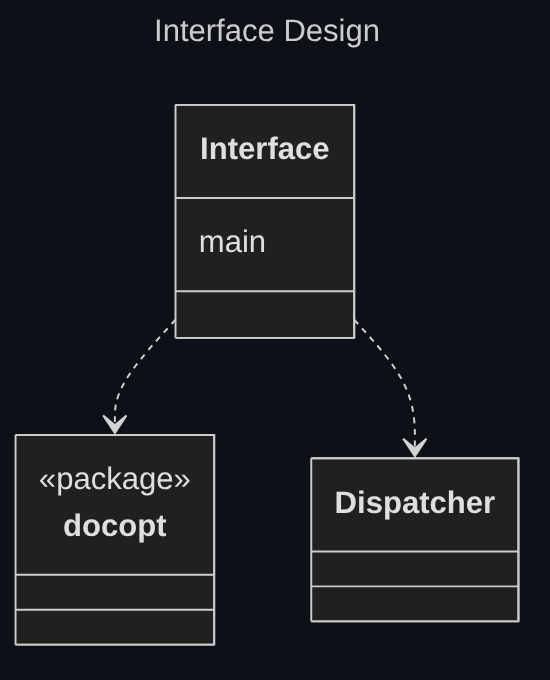
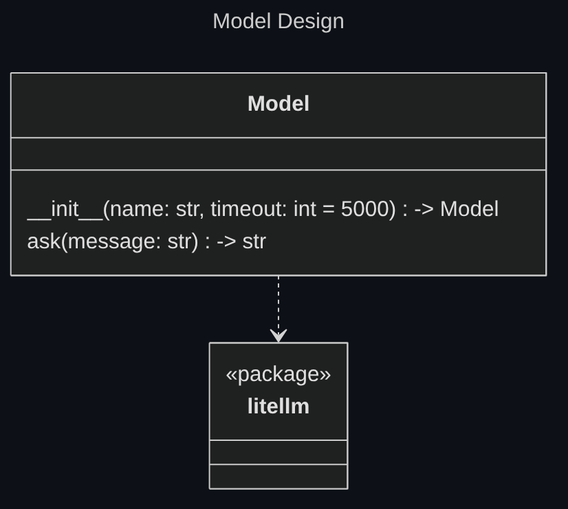

## Language

Python is the de-facto standard language for Machine Learning and LLM APIs.

Python also has a good cli interface generator in the [docopt package](https://github.com/jazzband/docopt-ng).

Python is a simple and easy to use language, often used to create simple working prototypes.

Since the project has a rather small scope, it's goals are to test and prototype the concept and for the good available libraries python is the chosen language for this project.

# Modules

### Interface

The [docopt](https://github.com/jazzband/docopt-ng) package is used to define the arguments accepted by AutoDev.

The Interface module calls the dispatch function exposed by the Dispatcher with the parced cli arguments provided by the user as arguments.



### Dispatcher

Similar to a router in a web application, the Dispatcher calls the correct handlers with correct arguments depending on argments passed through the cli.


### Handlers

The handlers expose the high level functionalities of AutoDev.

They call services to execute the actual business logic.


### Services

The services define business logic for AutoDev's functionalities.


#### Prompt

The prompt is generated from a json file specification.

The json file must have the following structure:

```json
{
    "depth": <depth_level>
    "premise": <premise_prompt>
    "conclusion": <conclusion_prompt>
    "fsobject": <file_system_object_prompt>
}
```

##### \<depth_level\> 

`\<depth_level\>` is the max depth level that should be reached when traversing the directory tree.

The value of `\<depth_level\>` must be an integer.

If `\<depth_level\>` is set to 0 then the project directory contents will not be considered when creating the prompt. Only the premise will compse the used prompt.

If `\<depth_level\>` is set to a value greater than 0 then the project directory will be traversed up to the depth indicated by the value of `\<depth_level\>`, and the directories and files encountered during traversal will be used to generate the prompt.

##### \<premise_prompt\>

`\<premise_prompt\>` is the first part of the prompt to be passed to the LLM model.

The value of `\<premise_prompt\>` must be a string.

The value of `\<premise_prompt\>` is used to generate the first part of the prompt passed to the LLM.

The value of `\<premise_prompt\>` is expected to contain some information about the task being requested, as in the request to generate a dev env configuration using the nix language.

##### \<conclusion_prompt\>

`\<conclusion_prompt\>` is the final part of the prompt to be passed to the LLM model.

The value of `\<conclusion_prompt\>` must be a string.

The value of `\<conclusion_prompt\>` is used to generate the last part of the prompt passed to the LLM.

The value of `\<conclusion_prompt\>` is expected to contain some information about how to output the configuration, as in specifing that no text should be generated apart from the actuall nix code to be placed in the flake.nix file.

##### \<file_system_object_prompt\>

`\<file_system_object_prompt\>` is the prompt to be passed for every file system object visited.

The value of `\<file_system_object_prompt\>` must be a string.

For every directory or file traversed, as per the `\<depth_level\>` value, the value of `\<file_system_object_prompt\>` will be repeated.

In the value of `\<file_system_object_prompt\>` the following tags will be filled according to the file system object being considered:

- `\<fso_name\>`: will be replaced with the file system object's name
- `\<fso_contents\>`: will be replaced with the file system object's fso_contents

In the case of directories `\<fso_contents\>` will contain the files filled

##### Tags

If present in the values of `\<premise_prompt\>` or/and `\<conclusion_prompt\>` the following tags will be replaced as follows:

- `\<project_tree\>`: will be replaced with a project directory tree rappresenation, up to the depth specified in <depth_level>

If present in the value of `\<file_system_object_prompt\>` the following tags will be replaced as follows, according to the file system object being considered at that point:

- `\<fso_name\>`: will be replaced with the file system object's name
- `\<fso_contents\>`: will be replaced with the file system object's fso_contents

In the case of directories `\<fso_contents\>` will be replaced by the names of the files and directories contained in the considered directory.

In the case of files `\<fso_contents\>` will contain the considered file contents.

##### Default prompt

The default prompt style used by AutoDev is the following:
<!-- TODO add default style -->

```json

```

This default prompt style was selected by using the best performing prompt style from the [test](./testing.md) portion of this project.

#### Model

The Model module is a wrapper around the [litellm](https://github.com/BerriAI/litellm) package.

This wrapper serves as an anti-corruption layer, ensuring if the underlying package would change only the Model module would have to be changed.

Also the Model interface only exposes the needed methods for AutoDev, hiding additional functionalities the underlying package provides.



#### Output

The Output service is reponsible for the outputs of the project.

The Output service must be initialized before use. The initialization is necessary to specify if the output should be quiet for this run.

For terminal based outputs the [rich](https://github.com/Textualize/rich) package.

For file creation the os python built package is used.


[Back to index](./index.md) |
[Previous Chapter](./architectural-design.md) |
[Next Chapter](./implementation.md) |
