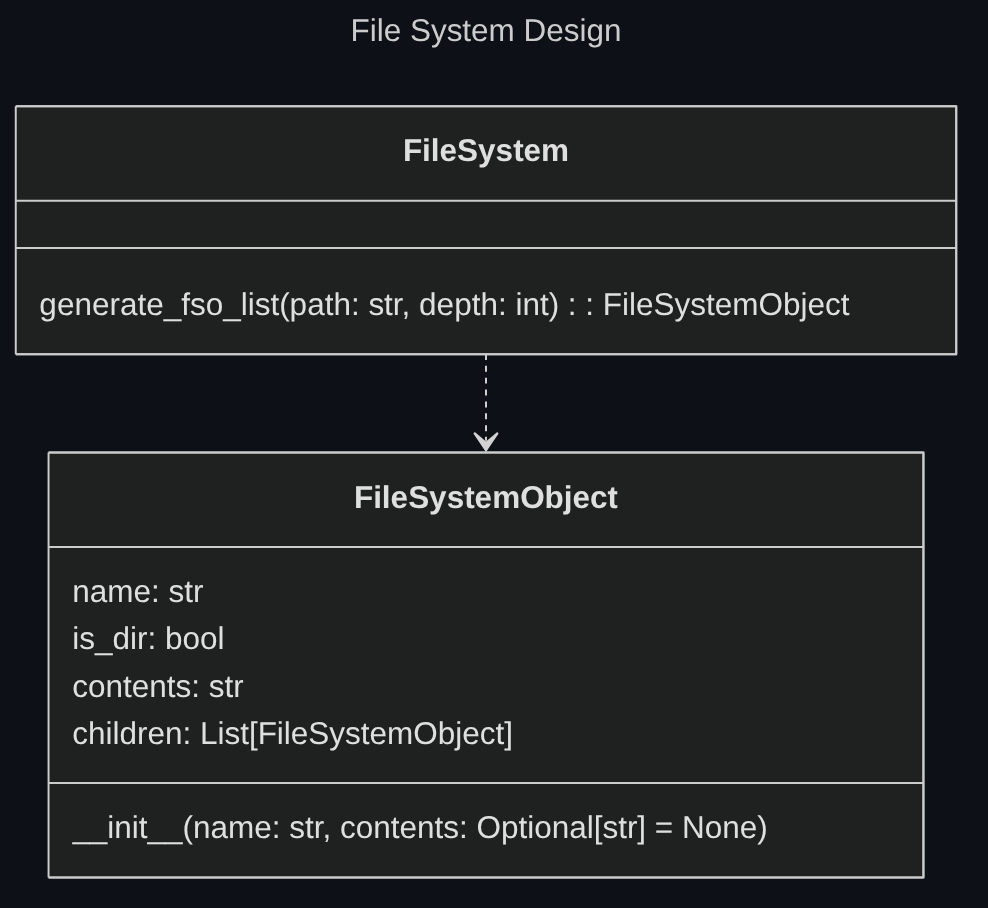

## Source Code Organization

Since python is the language choosen, some decisions should be made in terms of source code organization, as there are varying approches possible when considering python standards.

Although the project is of small scope, python module system is used to improve source code organization.

The `__init__.py` file for every module provides only the interface of the module, by importing what should be exposed to the module user.

The actual module code is stored in a python file named after the module itself.

Additional organization can be provided by creating submodules or additional python files, all referred by the python file named after the module itself.

The following is an example of a module named 'example' with a submodule named 'submodule':

<!-- 
generated with https://tree.nathanfriend.com/ 

example
  submodule
    __init__.py
    submodule.py
  __init__.py
  example.py
  utils.py
-->

```none
example/
├── submodule/
│   ├── __init__.py
│   └── submodule.py
├── __init__.py
├── example.py
└── utils.py
```

Collections of modules in an outer module that does not provide functionaties itself should omit the presence of the `__init__.py` file, as it is useless.

## Directory tree rappresentation

The FileSystem class is used to rappresent directory structures.

Since the LLM used must understand the project contents to generate the dev env config, this class is used to rappresent the directory tree of the project.



## Exceptions

During development the necessity to create custom exception types arose from the necessity of handling various usage errors in the correct manner, ensuring the user was correctly notified of the mistake.

### Initial solution

Initially custom 'per module' exception types where employed.

<!--
generated with https://tree.nathanfriend.com/ 

module_a
  __init__.py
  module_a.py
  exceptions.py
module_b
  __init__.py
  module_b.py
-->
```none
.
├── module_a/
│   ├── __init__.py
│   ├── module_a.py
│   └── exceptions.py
└── module_b/
    ├── __init__.py
    └── module_b.py
```

If `module_b` needed to catch an exception type defined in the `module_a/exceptions.py` file, it would import them accordingly.

This system proved fiddly and unneccessarily verbose when the same exceptions would be catcher by modules with further dependency from the module defining them.

If a `module_c` is introduced, that depends on `module_b` and must catch custom exceptions two possible solutions can be used:


- `module_c` can import the exceptions from `module_a`, creating a maybe undesired dependency between `module_c` and `module_a`
- `module_b` can itself define custom exceptions that can be imported by `module_c`

The second solution is preferabble but if the new exceptions defined in `module_b` are simple copy pastes of the exceptions defined by `module_a` this solutions seems to violate the DRY principle.

### Final solution

Custom exceptions have been defined in their own module, and only the modules that need to throw or catch the exceptions import them.

This allows the modules that catch the exceptions to only depend on the exceptions module and not depend on the modules that actually throw them.

[Back to index](./index.md) |
[Previous Chapter](./detailed-design.md) |
[Next Chapter](./testing.md) |
