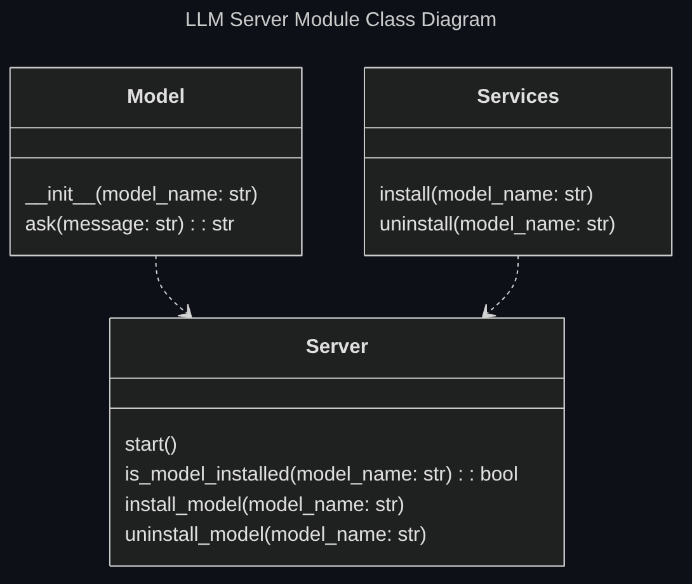

## Source Code Organization

### Directory Structure

The main AutoDev source code is located at `src/main`, with it's entry point being `src/main/main.py`

The test source code is located at `src/test`, with it's entry point being `src/test/main.py`

### Module Structure

Since python is the language choosen, some decisions should be made in terms of module code organization, as there are varying approches possible when considering python standards.

Given the projects small scope, the barebones module system is used.

A module is define by a python file.

Collection of modules can be created by grouping files in directories.

The `__init__.py` file format was considered, as it can work as an interface between modules, defining what methods are exposed to users of a module, but given the limited scope of the project it has been omitted.

Private methods and attributes are simply identified by a starting underscore (`_`).

Although this method is less 'safe' it is preffered for this project.

Whenever the project complexity should increase a refactor of the source code organization would be considered.

## Directory tree rappresentation

The FileSystem class is used to rappresent directory structures.

Since the LLM must understand the project contents to generate the dev env config, this class is used to rappresent the directory tree of the project.


## Exceptions

During development the necessity to create custom exception types arose from the necessity of handling various usage errors in the correct manner, ensuring the user was correctly notified of the mistake.

### Initial solution

Initially custom 'per module' exception types where employed.

<!--
generated with https://tree.nathanfriend.com/ 

module_a
    module_a.py
    exceptions.py
module_b.py
-->
```none
.
├── module_a/
│   ├── module_a.py
│   └── exceptions.py
└── module_b.py
```

If `module_b` needed to catch an exception type defined in the `module_a/exceptions.py` file, it would import them accordingly.

This system proved fiddly and unneccessarily verbose when the same exceptions would be catcher by modules with further dependency from the module defining them.

If a `module_c` is introduced, that depends on `module_b` and must catch custom exceptions two possible solutions can be used:


- `module_c` can import the exceptions from `module_a`, creating a maybe undesired dependency between `module_c` and `module_a`
- `module_b` can itself define custom exceptions that can be imported by `module_c`

The second solution is preferabble but if the new exceptions defined in `module_b` are simple copy pastes of the exceptions defined by `module_a` this solutions seems to violate the DRY principle.

### Final solution

Custom exceptions have been defined in their own module, and only the modules that need to throw or catch the exceptions import them.

This allows the modules that catch the exceptions to only depend on the exceptions module and not depend on the modules that actually throw them.

## LLM Server Module

Although the high level LLM API used is [litellm](https://www.litellm.ai/), all models used are available through [ollama](https://ollama.com/).

To use ollama models a local ollama model should be running on the system for the litellm API to work.

A new module, `server.py`, has been created to expose methods that can be used to interact with the language server.



This module is an implementation of the 'anti-curruption layer' pattern relative to the ollama server dependency, while the Model module is an 'anti-curruption layer' relative to the litellm dependency.

[Back to index](./index.md) |
[Previous Chapter](./detailed-design.md) |
[Next Chapter](./testing.md) |
